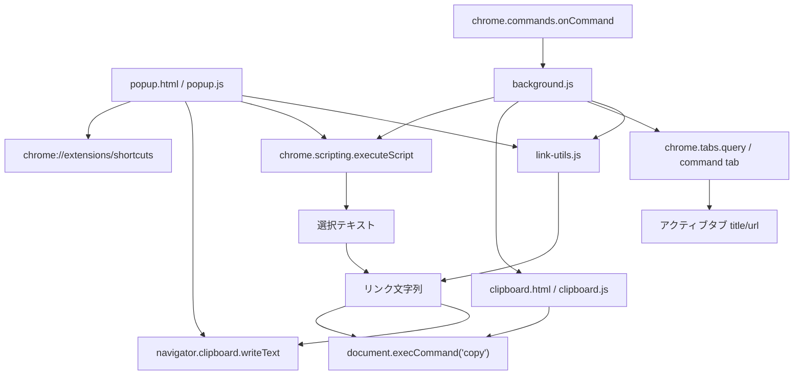

# Markdown Link Copier Design

## 概要

Markdown Link Copier は、表示中のアクティブタブのタイトルと URL を取得し、選択した形式のリンク文字列としてクリップボードへコピーする Chrome 拡張機能である。ページ内でテキストが選択されている場合は、その選択テキストを引用としてリンクの前に付ける。

現行実装は Manifest V3 の拡張で、ポップアップ操作とブラウザ内キーボードショートカットの 2 つの入口を持つ。ポップアップではフォーマット行をクリックすると即コピーされ、ブラウザ内では Chrome Extensions `commands` API に登録したショートカットからコピーされる。

## ファイル構成

| ファイル | 役割 |
| --- | --- |
| `manifest.json` | 拡張機能のメタデータ、権限、ポップアップ、background service worker、commands、アイコンを定義する。 |
| `popup.html` | ポップアップ UI とインライン CSS を定義する。 |
| `popup.js` | ポップアップでのフォーマットクリック、ショートカット表示、Chrome ショートカット設定画面への遷移を担当する。 |
| `background.js` | `chrome.commands.onCommand` を受け取り、ショートカットからのコピー処理とバッジ通知を実行する。 |
| `clipboard.html` | service worker からクリップボードコピーを行うための offscreen document。 |
| `clipboard.js` | offscreen document 上で `document.execCommand('copy')` を実行する。 |
| `link-utils.js` | フォーマット定義とリンク文字列生成処理を popup と background で共有する。 |
| `icon16.png` | 16x16 の拡張アイコン。 |
| `icon48.png` | 48x48 の拡張アイコン。 |
| `icon128.png` | 128x128 の拡張アイコン。 |

## 実行環境

この拡張は Chrome Extension Manifest V3 として動作する。`offscreen` API を使用するため、`minimum_chrome_version` は `109` である。

`manifest.json` では次の権限を要求している。

| 権限 | 用途 |
| --- | --- |
| `activeTab` | ユーザー操作または commands API のショートカット実行時に、現在のアクティブタブのタイトルと URL を取得する。 |
| `clipboardWrite` | 生成したリンク文字列をクリップボードへ書き込む。 |
| `offscreen` | background service worker からクリップボード操作用の非表示 document を作成する。 |
| `scripting` | ユーザー操作または commands API のショートカット実行時に、アクティブタブへ一時的な関数を注入して選択テキストを取得する。 |

`action.default_popup` には `popup.html` が指定されている。`background.service_worker` には `background.js` が指定されており、ブラウザ内ショートカットのイベントを受け取る。

## コマンド設計

キーボードショートカットは `manifest.json` の `commands` で 3 つ定義している。

| command | 初期ショートカット | macOS 初期ショートカット | 形式 |
| --- | --- | --- | --- |
| `copy-markdown` | `Alt+Shift+M` | `Option+Shift+M` | Markdown |
| `copy-html` | `Alt+Shift+H` | `Option+Shift+H` | HTML |
| `copy-text` | `Alt+Shift+T` | `Option+Shift+T` | Text |

ユーザーは Chrome 標準の `chrome://extensions/shortcuts` で割り当てを変更できる。拡張内ではショートカットを直接編集せず、現在の割り当てを `chrome.commands.getAll()` で読み取ってポップアップに表示する。

## アーキテクチャ

現行実装は、ポップアップ操作とショートカット操作の入口だけを分け、リンク生成の定義を共有する構成である。

## UI 設計

ポップアップは次の要素で構成される。

| 要素 | 役割 |
| --- | --- |
| ヘッダー | 拡張名を表示する。 |
| フォーマット行 | Markdown、HTML、Text の各コピー操作を実行するボタン。 |
| ショートカット表示 | `chrome.commands.getAll()` で取得した現在の割り当てを表示する。未割り当ての場合は `未設定` と表示する。 |
| ステータス領域 | コピー成功または失敗を短く表示する。 |
| `ショートカットを変更...` ボタン | `chrome://extensions/shortcuts` を新しいタブで開く。 |

従来の `Copy Link` ボタンは廃止し、各フォーマット行そのものをクリック可能な `button` としている。

## フォーマット定義

フォーマット定義は `link-utils.js` の `LinkCopier.formats` に集約している。

| id | command | label | 出力形式 |
| --- | --- | --- | --- |
| `markdown` | `copy-markdown` | `Markdown` | `[title](url)` |
| `html` | `copy-html` | `HTML` | `<a href="url">title</a>` |
| `text` | `copy-text` | `Text` | `title - url` |

各形式はショートカット成功時に表示する短いバッジ文字列も持つ。Markdown は `MD`、HTML は `HTML`、Text は `TXT` を表示する。

`LinkCopier.formatLink(formatId, title, url)` がリンク文字列生成を担当し、`LinkCopier.formatClipboardText(formatId, title, url, selectionText)` が選択テキスト付きの最終コピー文字列生成を担当する。popup と background の両方がこれらの関数を使うため、形式追加時の変更箇所を抑えられる。

## ポップアップからのコピー処理

ユーザーがポップアップ上のフォーマット行をクリックすると、`popup.js` が次の順序で処理する。

1. クリックされた要素の `data-format` から形式 ID を取得する。
2. `chrome.tabs.query({ active: true, currentWindow: true })` でアクティブタブを取得する。
3. `chrome.scripting.executeScript` でアクティブタブの選択テキストを取得する。選択がない場合や取得できない場合は空文字として扱う。
4. `LinkCopier.formatClipboardText(formatId, tab.title, tab.url, selectionText)` でコピー対象文字列を生成する。
5. `navigator.clipboard.writeText` でクリップボードへ書き込む。
6. 成功ステータスを表示し、短時間後にポップアップを閉じる。

Clipboard API が使えない、タブ情報が取得できない、書き込みに失敗する、といった場合はエラー表示に切り替える。

## ショートカットからのコピー処理

ユーザーがブラウザ内で登録済みショートカットを押すと、`background.js` の `chrome.commands.onCommand` が発火する。

処理順序は次の通りである。

1. 受け取った command 名を `LinkCopier.getFormatByCommand(command)` で形式に変換する。
2. command イベントから渡された tab、または `chrome.tabs.query` でアクティブタブを取得する。
3. `chrome.scripting.executeScript` でアクティブタブの選択テキストを取得する。選択がない場合や取得できない場合は空文字として扱う。
4. `LinkCopier.formatClipboardText(format.id, tab.title, tab.url, selectionText)` でコピー対象文字列を生成する。
5. `ensureOffscreenDocument()` で `clipboard.html` を用意する。
6. `chrome.runtime.sendMessage` で offscreen document にコピー対象文字列を渡す。
7. `clipboard.js` が非表示 textarea に文字列を入れ、`document.execCommand('copy')` でクリップボードへ書き込む。
8. 成功時は拡張アイコンのバッジに形式名を短く表示し、短時間後に消す。

service worker は DOM を持たないため、クリップボード操作は offscreen document に委譲している。offscreen document はフォーカスできないため、`navigator.clipboard.writeText` ではなく DOM の copy command を使う。

## バッジ通知

ショートカットからコピーした場合、ページ上には UI を挿入せず、`chrome.action` のバッジを使って拡張アイコン上に短いフィードバックを表示する。

| 条件 | バッジ | 色 | 表示時間 |
| --- | --- | --- | --- |
| Markdown コピー成功 | `MD` | 緑 | 900ms |
| HTML コピー成功 | `HTML` | 緑 | 900ms |
| Text コピー成功 | `TXT` | 緑 | 900ms |
| コピー失敗 | `!` | 赤 | 1500ms |

連続してショートカットが押された場合に古いタイマーが新しいバッジを消さないよう、`background.js` は表示ごとに `badgeDisplayId` を更新している。

## データと状態

永続化されるアプリケーション状態はない。ショートカット割り当ては Chrome 側で管理され、拡張は `chrome.commands.getAll()` で現在値を読み取るだけである。

`chrome.storage` は使用していないため、ユーザー設定、コピー履歴、直近の選択形式などは保存されない。

## エラーハンドリング

現行実装で扱っているエラーは次の通りである。

| エラー条件 | popup の挙動 | background の挙動 |
| --- | --- | --- |
| タブ情報が取得できない | ステータス領域に失敗を表示する。 | console error を出力する。 |
| Clipboard API / copy command が利用できない | ステータス領域に失敗を表示する。 | offscreen document から失敗応答を返し、console error を出力する。 |
| クリップボード書き込みに失敗 | ステータス領域に失敗を表示する。 | console error を出力する。 |
| 未対応 command / format | popup では未対応形式として表示する。 | command を無視する。 |

## セキュリティとプライバシー

この拡張は、ユーザーがポップアップでフォーマットをクリックした時、または登録済みショートカットを押した時に、現在のアクティブタブのタイトルと URL を読み取る。読み取った情報はクリップボードに書き込まれるだけで、外部ネットワークへの送信やローカルストレージへの保存は行っていない。

外部スクリプトや外部 CSS は読み込んでいない。現行コード上、ネットワーク通信を行う API 呼び出しも存在しない。

## 既知の制約

現行実装から確認できる制約は次の通りである。

| 制約 | 内容 |
| --- | --- |
| 出力文字列のエスケープなし | Markdown、HTML ともにタイトルや URL、選択テキスト内の特殊文字をエスケープしていない。 |
| HTML 属性値のエスケープなし | HTML 形式では `href` とリンクテキストに値を直接埋め込む。 |
| ショートカット編集は Chrome 標準 UI 依存 | 拡張内では割り当てを直接変更せず、`chrome://extensions/shortcuts` に遷移する。 |
| ショートカット衝突の可能性 | OS、Chrome、他拡張のショートカットと衝突した場合、Chrome 側で未割り当てになる可能性がある。 |
| 成功通知はバッジのみ | ショートカットからコピーした場合、ページ内トーストや通知は表示せず、拡張アイコンのバッジだけで知らせる。 |
| テストなし | このリポジトリには自動テストやテストランナー設定が存在しない。 |
| ビルド工程なし | HTML、JS、画像をそのまま拡張として読み込む構成である。 |

## 拡張時の設計方針

この節は現行実装からの推測を含む。

このコードベースは小さく、依存関係を持たないことが特徴である。そのため、今後の変更でもまずはプレーンな HTML/CSS/JavaScript のまま保つ方針が自然だと考えられる。

形式追加時は `link-utils.js` の `formats` と `formatLink`、`manifest.json` の `commands`、`popup.html` の表示行を合わせて変更する。形式数が増える場合は、`popup.html` の静的マークアップをやめて `LinkCopier.formats` から UI を生成する設計に寄せるとよい。

ユーザー定義テンプレート、コピー履歴、直近フォーマットの保存などが必要になった場合は、`chrome.storage` の導入を検討する。

## 変更時の注意点

1. Chrome 拡張の権限追加は、ユーザーに表示される許可内容へ影響するため、必要最小限に保つ。
2. URL やタイトルを HTML に埋め込む処理を変更する場合は、HTML エスケープを検討する。
3. Markdown 出力を変更する場合は、タイトル内の `]` や URL 内の `)` など、Markdown 構文に影響する文字を考慮する。
4. `commands` の suggested shortcut は OS や Chrome の予約ショートカットと衝突しないか確認する。
5. background からのコピーは offscreen document に依存するため、`offscreen` permission と `clipboard.html` / `clipboard.js` の整合性を保つ。
6. 自動テストを追加する場合は、まず `LinkCopier.formatLink` を対象にすると小さく始めやすい。

## 手動確認観点

現行リポジトリには自動テストがないため、動作確認は Chrome の拡張機能ページから unpacked extension として読み込んで行う。

確認すべき観点は次の通りである。

| 観点 | 確認内容 |
| --- | --- |
| ポップアップ表示 | 拡張アイコンをクリックしてフォーマット行とショートカット表示が表示される。 |
| Markdown クリックコピー | Markdown 行をクリックして `[title](url)` がコピーされる。 |
| 選択テキスト付きコピー | ページ上のテキストを選択した状態でコピーすると、`“選択テキスト”`、空行、作成したリンクの順でコピーされる。 |
| HTML クリックコピー | HTML 行をクリックして `<a href="url">title</a>` がコピーされる。 |
| Text クリックコピー | Text 行をクリックして `title - url` がコピーされる。 |
| ショートカット表示 | `chrome.commands.getAll()` の結果が各行に反映され、未割り当ては `未設定` になる。 |
| ショートカット設定導線 | `ショートカットを変更...` から `chrome://extensions/shortcuts` が開く。 |
| Markdown ショートカットコピー | `copy-markdown` のショートカットで Markdown 形式がコピーされる。 |
| HTML ショートカットコピー | `copy-html` のショートカットで HTML 形式がコピーされる。 |
| Text ショートカットコピー | `copy-text` のショートカットで Text 形式がコピーされる。 |
| ショートカット成功バッジ | ショートカットコピー成功時に `MD` / `HTML` / `TXT` の緑バッジが短時間表示される。 |
| ショートカット失敗バッジ | ショートカットコピー失敗時に `!` の赤バッジが短時間表示される。 |
| エラー時表示 | popup でタブ情報取得失敗やクリップボード書き込み失敗時に失敗ステータスが表示される。 |
